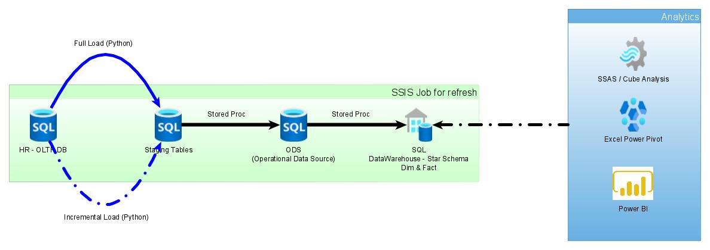
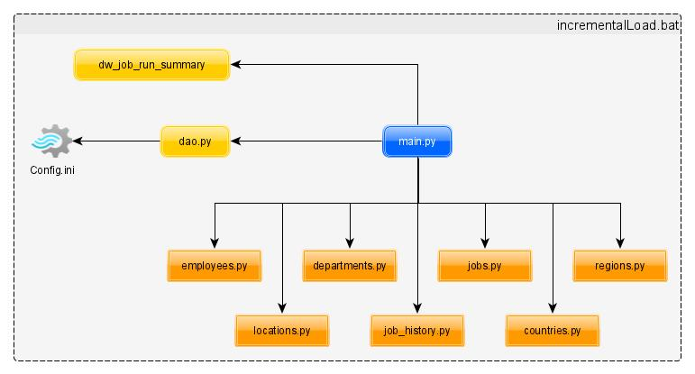
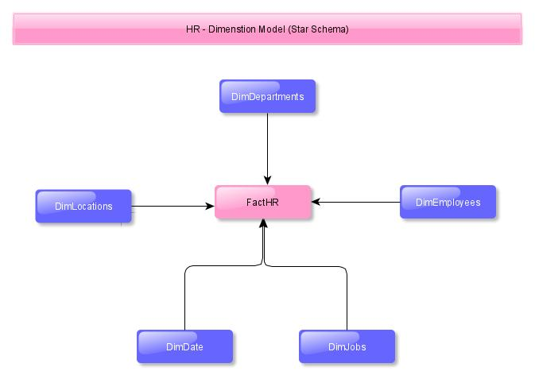

# DataWarehouse And Reporting
## Videos
1. Data Warehouse - 1 - Establish Connection using Python for Full Load - https://youtu.be/d8BcIFI1YSc
2. Data Warehouse - 2 - Creating CSV file using Pandas DataFrame for Full Load - https://youtu.be/GOH6NS4kNf0
3. Data Warehouse - 3 - read_csv of DataFrame & insert records from python for Full Load https://youtu.be/4HBIDX2j9Eg
4. Data Warehouse - 4 - read_csv of DataFrame & insert records from python for Full Load https://youtu.be/TOG_8WHsjFc
5. Data Warehouse - 5 - Exception handling in python for Full Load https://youtu.be/tiA-ZkuVRdE
6. Data Warehouse - 6 - Logging Success and Error Message for Full Load https://youtu.be/TfmmvddDcJU
7. Data Warehouse - 7 - Global Variable for Full Load https://youtu.be/oQouHYIuRDs
8. Data Warehouse - 8 - Understanding ODS Data and Structure https://youtu.be/JEtmLpyDL5g
9. Data Warehouse - 9 - Loading ODS Table using Stored Proc https://youtu.be/wKvaDRFo7nw
10. Data Warehouse - 10 - Automate ODS Load using SSIS Package https://youtu.be/jRMMNn2s9aw
11. Data Warehouse - 11 - Load Dim Tables using Stored Proc https://youtu.be/urLBGp3_3PY
12. Data Warehouse - 12 - Load Date Dim using Excel Formulae https://youtu.be/tCM1bJO7_N0

## Pre-Requisit
1. SQL Server (or any relational database)
2. Python for ETL
3. SSAS / Excel for reporting
4. Sample data of HR schema for this was downloaded from https://github.com/oracle/db-sample-schemas/releases/tag/v12.2.0.1
5. Vishal Studio Code
## Data-Warehouse Flow from Transaction DB till Reporting
Following image depicts data flow of data-warehouse system from Transactional System -> Till Data Warehouse Star Schema and then reporting with different options bassed on DW data.

As you can see in diagram 
1. **Transaction DB** -- Data from transaction DB (HR db in this case) we move to staging table first on daily (or weekly / monthly based on need) basis using Full or Incremental Load. In this case we will use Python for ETL, you can use any other tool such as Informatica, SSIS etc. for this.
2. **Staging Table** -- Structure of Staging tables are exactly same as transaction DB, except it has 2 more columns of CreationDate & UpdationDate to document when table was last refreshed. Staging tables are mostly truncate & reload
3. **ODS (Operational Data Source)** -- Data from multiple Staging tables will be combined into single ODS table; also ODS table stores historical data (insert only)
4. **DataWarehouse** -- Data from ODS will be loaded into Dim (Non Measureable Attribute) & Fact (Measurable Attributes) on daily (or weekly / monthly based on need) basis. In this case load from ODS till DW will happen using Stored Proc
5. **Reporting** -- Final reporting will happen using SSAS Cube(Tabular model), Excel Power Pivot, or Power BI. (you can use any tool such as SQL, BO, OBIEE for data analysis)

## Incremental Load
In this case, we are going to use Python for ETL (Extraction Transform Load), and there are 2 ways we are going to see 
1. **Full Load** -- Pulling entire data from source tables to staging tables
2. **Incremental Load** -- Only pulling delta records (updated or newly created records) from source tables to staging tables
We will see difference between these 2 types and when to use each particular type.
Following image ETL using Python which we are going to see in this example


# How to retrieve data from SQL Server using Python
https://stackoverflow.com/questions/51820189/retrieve-data-from-sql-server-database-using-python
```
import pyodbc 
cnxn = pyodbc.connect("Driver={SQL Server Native Client 11.0};"
                        "Server=mySRVERNAME;"
                        "Database=MYDB;"
                        "uid=sa;pwd=MYPWD;"
                        "Trusted_Connection=yes;")


cursor = cnxn.cursor()
cursor.execute('select DISTINCT firstname,lastname,coalesce(middlename,\' \') as middlename from Person.Person')

for row in cursor:
    print('row = %r' % (row,))
```

# How to read data from Config file using Python
https://stackoverflow.com/questions/19379120/how-to-read-a-config-file-using-python

```
[My Section]
path1 = D:\test1\first
path2 = D:\test2\second
path3 = D:\test2\third
```

```
import ConfigParser

config = ConfigParser.ConfigParser()
config.readfp(open(r'abc.txt'))
path1 = config.get('My Section', 'path1')
path2 = config.get('My Section', 'path2')
path3 = config.get('My Section', 'path3')
```
# ModuleNotFoundError: No module named 'ConfigParser'
https://stackoverflow.com/questions/14087598/python-3-importerror-no-module-named-configparser

# ETL - Load it to Flat File First  
ETL Load from OLTP system to Staging tables can happen by
1. Database to Database -- Both systems - OLTP & Staging - are in different environments, you can directly load data from OLTP to Staging, however, this will keep the connection open to source OLTP till the time load to Staging gets finish. For small datasets, this will work, but if you have millions of records in source, then keeping connection open is not a good idea. 
2. Database to Flat File -- It's always advisable to load data from OLTP to Flat File first and then into Staging. Remember, loading data into (or from) Flat File from OLTP will take considerably less time and this way you don't have to keep your source(or target) connection open for longer period. 

### Creating Multidimentional List
Next task is to get records from database into a list. You can refer code from https://docs.python.org/3.3/tutorial/datastructures.html. 

### Use Pandas Dataframe
Python-Pandas Dataframe is very easy & convenient way to deal with data and for ETL we will use that. You can refer my earlier videos https://youtu.be/ZtXMnCw10Og (2 mins 13 sec) & https://youtu.be/9sjT8EsaoYA (3 mins 58 sec) of using "iloc" of Pandas DataFrame. 

### Use to_csv
Once DataFrame is created, use to_csv methond of python to export data into csv file.

### Use read_csv to read data from csv
Once you create separate csv file for each transaction table which you want to load into staging area, next task is to read those csv files into data frame. For that use read_csv method of pandas dataframe which will return DataFrame object. You can refer https://www.shanelynn.ie/python-pandas-read_csv-load-data-from-csv-files/ for more details

### Iterate through DataFrame
Once data frame is created - which will consists of multiple records for each table - you need to insert those records into staging table. So, inorder to iterate DataFrame you can use following code 
```
import pandas as pd

df = pd.DataFrame({'c1': [10, 11, 12], 'c2': [100, 110, 120]})

for index, row in df.iterrows():
    print(row['c1'], row['c2'])
```
More information is available at https://stackoverflow.com/questions/16476924/how-to-iterate-over-rows-in-a-dataframe-in-pandas

### Insert into Staging
To insert each record from DataFrame, use following python code 
```
cnxn = pyodbc.connect('DRIVER={SQL Server};SERVER='+server+';DATABASE='+database+';UID='+username+';PWD='+ password)
cursor = cnxn.cursor()
### Insert Dataframe into SQL Server:
for index, row in df.iterrows():
    cursor.execute("INSERT INTO HumanResources.DepartmentTest (DepartmentID,Name,GroupName) values(?,?,?)", row.DepartmentID, row.Name, row.GroupName)
cnxn.commit()
cursor.close()
```
for more details you can visit https://docs.microsoft.com/en-us/sql/machine-learning/data-exploration/python-dataframe-sql-server?view=sql-server-ver15

### How to handle Null?
To handle null values in DataFrame use following code
```
dataFrame.fillna("", inplace=True)
```
For more details please visit https://pandas.pydata.org/pandas-docs/stable/reference/api/pandas.DataFrame.fillna.html

## Exception Handling in Python
Exception handling in python is somewhat similar to other languages such as Java or c#, we will be using following code 
```
# import module sys to get the type of exception
import sys

randomList = ['a', 0, 2]

for entry in randomList:
    try:
        print("The entry is", entry)
        r = 1/int(entry)
        break
    except Exception as e:
        print("Oops!", e.__class__, "occurred.")
        print("Next entry.")
        print()
print("The reciprocal of", entry, "is", r)
```
more information on this is available at https://www.programiz.com/python-programming/exception-handling

## How to rename index in Pandas DataFrame
You can use following code
```
df.index = [1, 2, 3]
df.columns = ['a', 'b', 'c']

print(df)
#     a   b   c
# 1  11  12  13
# 2  21  22  23
# 3  31  32  33
```
More details are available at https://note.nkmk.me/en/python-pandas-dataframe-rename/

## How to get current date time in Python
https://www.programiz.com/python-programming/datetime/current-datetime

## To store history of job run
Why its needed?
1. To understand if our load failed or it was succeeded
2. If failed, then what was the error?
3. If succeeded, how many records it pulled?
4. How long our jobs are taking to finish? how much data we are pulling everyday over a period of time?
```
CREATE TABLE [dbo].[dw_job_run_summary](
	[id] [int] IDENTITY(1,1) NOT NULL,
	[tablename] [varchar](100) NULL,-- table which is getting loaded
	[start_date_Time] [datetime] NULL, -- date time on which load has started
	[end_date_Time] [datetime] NULL, -- date time on which is load has finished
	[rows_processed] [int] NULL,	-- number of rows processed
	[status] [varchar](15) NULL, -- status of load (fail or success)
	[error_message] [varchar](2000) NULL, -- if failed, then error message
	[colid] [bigint] NULL,-- if failed, then which row failed
	[job_run_id] [int] NULL, -- indicates how many times the process has ran
	[created_on] [datetime] NULL default getdate() -- date when record got created
	)
	
```
# ODS Structure
Keep only 1 ODS table, and try to add maximum columns in that. Following is the table structure I have defined, but I forgot to add measurable attributes into it e.g. Salary, Max Salary, Min Salary, Commission Pct etc.
```
Create table ODS_HR
(
	id 					int IDENTITY(1,1) PRIMARY KEY
	, EMPLOYEE_ID 		int 
	, FIRST_NAME 		varchar(50)
    	, LAST_NAME			varchar(50)
    	, EMAIL				varchar(60)
    	, PHONE_NUMBER		varchar(30)
    	, StartDate			DateTime2(3)
	, EndDate			DateTime2(3)
    	, JOB_ID			varchar(30)
    	, MANAGER_ID		int 
    	, DEPARTMENT_ID		int	
    	, DEPARTMENT_NAME	varchar(50)
    	, LOCATION_ID		int
    	, CITY				varchar(50)
    	, STATE_PROVINCE	varchar(50)	
	, COUNTRY_NAME		varchar(50)	
	, REGION_NAME		varchar(50)	
	, CreatedOn			DateTime2(3) DEFAULT getDate()
	, UpdatedOn			DateTime2(3) DEFAULT getDate()
)
```
ODS Load we can do using any ETL tool, however in this video series I have used Stored Proc. You will find that SP in repisitory. Also, both Staging Load and ODS Load I have combined into single SSIS package, which we can automate later on. Note - In this case I have use Insert - Update stragegy, you can go for Delete \ Insert as well but that's not advisible.
# Dimentional Modeling
You can configure Data Warehouse mainly by two ways, Dimentional Modeling or 3NF Modeling - for more information you can refer to link - http://roelantvos.com/blog/comparisons-between-data-warehouse-modelling-techniques/
However, for this implementation we are going to implement simple Dimentional Model, which is as follows

## Dimentions
All non-measurable attributes we are going to keep in Dimention Tables. In our case, we are going too create following dimenstion tables. Also, Dimentation tables maintains historical records (same as ODS). You can also implement different  SCD (Slowly Changing Dimentions) types based on business need, however for this video we are not going to implement it to keep things simple as we can.
1. DimLocations -- Location, Country and Region records are combined into a single dimention table
2. DimDepartments
3. DimJobs
4. DimEmployees
5. DimDate
## Date Dimention
For any Data Warehouse implementation, you should have a separate date dimention. Now, columns in your date dimentions can very based on the business \ reporting need. There are several insert scripts you can find if you google it, few links I have specified below
1. https://www.sqlshack.com/implementing-different-calendars-in-reporting/
2. https://stackoverflow.com/questions/5635594/how-to-create-a-calendar-table-for-100-years-in-sql

However, for this video, we are going to use Excel. Using Excel formulae specified below, we will first create data as required, and then prepare insert statements using it.
We are going to create following columns in Date Dimentions along with their Excel formulae.
1. CalendarDate -- will be populated manually (its only for Excel)
2. month_id -- =Month(B2)
3. month_desc -- =TEXT(B2,"mmmm")
4. qurater_id -- =IF( OR(C2 = 1, C2=2, C2 = 3),1, IF(OR(C2 = 4, C2=5, C2 = 6),2,IF(OR(C2 = 7, C2=8, C2 = 9),3,4)))
5. qurater_desc -- ="Qtr " & REPT("0",2 - LEN(E2)) & E2
6. year_id -- =YEAR(B2)
7. day_number_of_week -- =SWITCH(I2,"Sunday",1,"Monday",2,"Tuesday",3,"Wednesday",4,"Thursday",5,"Friday",6,"Saturday",7)
8. day_of_week_desc -- =TEXT(B2,"dddd")
9. day_number_of_month -- =DAY(B2)
10. day_number_of_year -- =B2 - DATE(YEAR(B2),1,0)
11. week_number_of_year -- =WEEKNUM(B2)
12. year_month -- =YEAR(B2) & "-" & REPT("0",2 - LEN(C2)) & C2
13. calendar_date -- = '2021-01-02',
14. date_id -- =YEAR(B4) & REPT("0",2 - LEN(C4)) & C4 & REPT("0",2 - LEN(J4)) & J4

```
Create Table DimDate
(
	DateDimKey				int
	, calendar_date			varchar(10)
	, month_id				smallint
	, month_desc 			varchar(15)
	, qurater_id			smallint
	, qurater_desc 			varchar(6)
	, year_id 				int
	, day_number_of_week	smallint
	, day_of_week_desc 		varchar(15)
	, day_number_of_month 	smallint
	, day_number_of_year 	smallint
	, week_number_of_year 	smallint
	, year_month 			varchar(7)	
)
```
## Fact
All measurable attributes we keep in Fact table. Though there are many Dim tables in DW implementation, there can be 1 (max 2 or 3) fact in DW implementation. In our case, we are going to keep only 1 Fact table.


